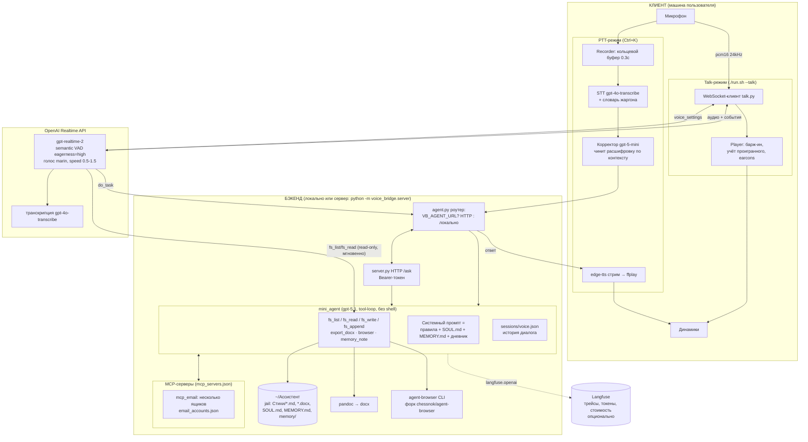

# Архитектура voice-bridge

Голосовой ассистент для слабовидящего писателя. Два режима ввода, один агент-исполнитель,
вся работа с файлами — в изолированной папке.

## Потоки

**Живой разговор**: микрофон → Realtime API (VAD сам режет реплики) → голос в ответ ~0.5с.
Болтовня — модель сама; вопросы о файлах — прямые fs_list/fs_read (1 шаг);
действия — do_task → mini_agent (earcon «работаю» → earcon «готово»).
Перебивание: flush плеера + conversation.item.truncate по проигранным мс.
Сессия >12k токенов → старые ходы сжимаются в summary (gpt-5-mini).

**PTT**: зажал Ctrl+K → говоришь → отпустил → STT → корректор → агент → озвучка стримом.

**Клиент-сервер**: бэкенд выносится на сервер (VB_SERVER_BIND + VB_AGENT_TOKEN),
локально остаётся только звук. Память и файлы живут рядом с бэкендом.

## Безопасность

- Файлы — только внутри ~/Ассистент (`_safe_path` отбивает ../ и абсолютные пути).
- Белый список инструментов, shell-доступа нет вообще.
- Браузер — только разрешённые подкоманды agent-browser.
- HTTP-бэкенд наружу не стартует без токена.
- Почта/WhatsApp — только после голосового подтверждения адресата.

## Конфигурация (всё через .env / VB_*)

| Группа | Ключи |
|---|---|
| Realtime | VB_REALTIME_MODEL, VB_REALTIME_VOICE, VB_REALTIME_STT_MODEL, VB_VAD_EAGERNESS, VB_RT_SUMMARY_TOKENS |
| PTT | VB_HOTKEY, VB_STT, VB_STT_PROMPT, VB_REWRITE_MODEL, VB_TTS_VOICE |
| Агент | VB_MINI_MODEL, VB_MINI_REASONING, VB_MINI_WORKDIR, VB_MINI_MAX_STEPS |
| Клиент-сервер | VB_AGENT_URL, VB_AGENT_TOKEN, VB_SERVER_BIND, VB_SERVER_PORT |
| Интеграции | VB_AGENT_BROWSER_BIN, mcp_servers.json, email_accounts.json |
| Трейсинг | LANGFUSE_PUBLIC_KEY, LANGFUSE_SECRET_KEY, LANGFUSE_BASE_URL |
